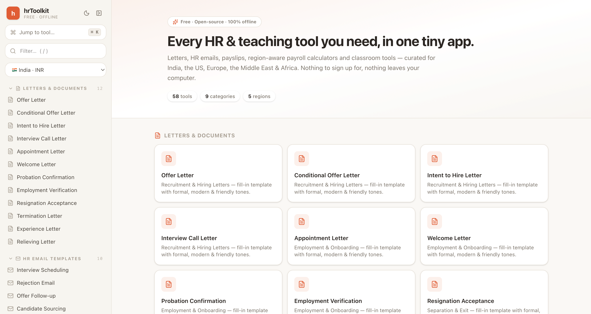
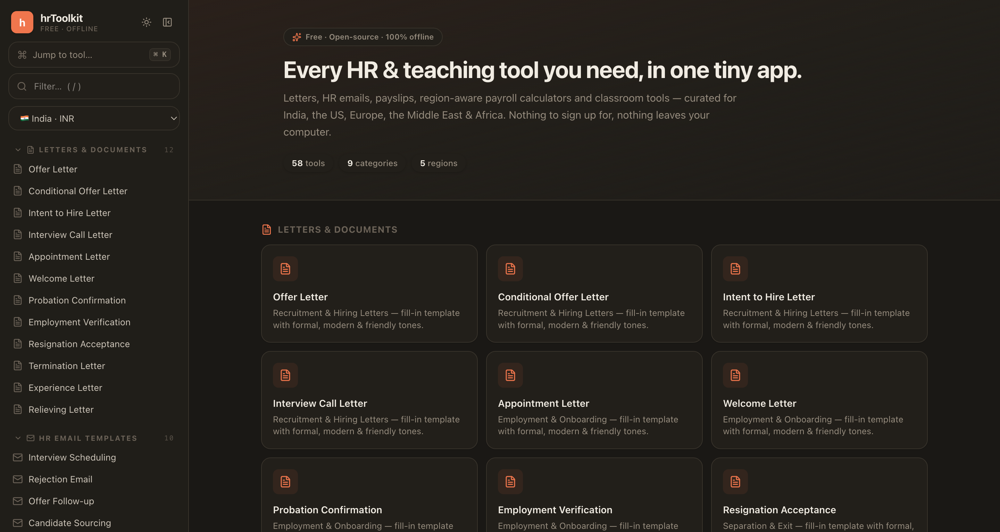
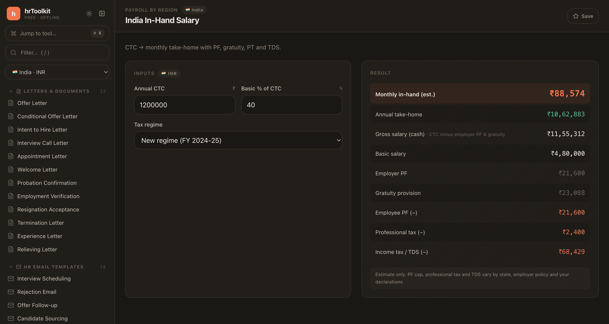
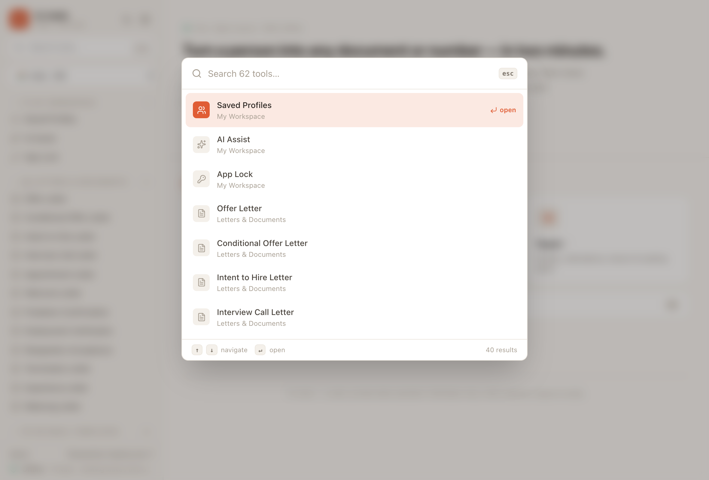

<div align="center">

# hrToolkit — Free, Offline HR & Payroll Toolkit

**60+ HR tools in one tiny desktop app.** Offer-letter & HR-email generators, payslips,
region-aware **payroll & tax calculators** (India · US · UK · Europe · UAE · Saudi · Nigeria · South Africa),
and classroom tools — **100% offline**. No accounts, no cloud, nothing leaves your machine.

[](https://github.com/Yupcha/hr-tools/actions/workflows/ci.yml)
[](./LICENSE)
[](https://github.com/Yupcha/hr-tools/releases)


[](https://tauri.app)
[](./CONTRIBUTING.md)
[](https://github.com/Yupcha/hr-tools/stargazers)

[**Download**](#-download) · [Features](#-whats-inside) · [Screenshots](#-screenshots) · [Build from source](#-develop) · [License](#-license)



</div>

---

## Why hrToolkit?

A **free, open-source alternative** to scattered web tools and paid HR software — for
recruiters, HR teams, payroll admins and teachers who want fast, private utilities
without sign-ups or subscriptions.

- 🔒 **Private & offline** — runs entirely on your computer; no accounts, no telemetry, no internet required.
- 📝 **Generate HR letters & emails** — offers, appointments, terminations, experience/relieving letters, and more, in **formal / modern / friendly** tones with one-click **Copy** and **Save as PDF**.
- 💸 **Region-aware payroll & tax calculators** — take-home / in-hand pay, gratuity, HRA, end-of-service, PAYE and more for 8 regions.
- 👤 **People-first** — save a company & its people once, then auto-fill every document.
- 🎨 **Beautiful & fast** — Notion-calm × Obsidian-dense UI, full **dark mode**, and a `⌘K` command palette.
- 🤖 **Optional AI & agentic use** — draft with a local model or your own key, and an [MCP server](#-ai-assist--agentic-use-optional) to drive the toolkit from agents.

> **Keywords:** free HR software · offer letter generator · HR email templates · payslip generator · take-home salary calculator · in-hand salary calculator India · gratuity calculator · UAE/Saudi end-of-service calculator · US paycheck calculator · UK take-home · HRA & PF/TDS calculator · offline HR app · open-source recruiter tools · Tauri desktop app.

## Contents

- [Download](#-download)
- [Screenshots](#-screenshots)
- [What's inside](#-whats-inside)
- [AI Assist & agentic use (optional)](#-ai-assist--agentic-use-optional)
- [Security & privacy](#-security--privacy)
- [Develop / build from source](#-develop)
- [Contributing](#-contributing)
- [FAQ](#-faq)
- [License](#-license)

---

## ⬇️ Download

Grab the latest build for your OS from the [**Releases**](https://github.com/Yupcha/hr-tools/releases) page:

| Platform | File |
| --- | --- |
| **macOS** | `.dmg` (Apple Silicon & Intel) |
| **Windows** | `.msi` / `.exe` |
| **Linux** | `.AppImage` / `.deb` |
| **Android** | `.apk` (sideload) — *early / experimental, see below* |

> **Heads-up — the apps are unsigned** (no paid code-signing certificate yet), so your OS may warn on first launch:
> - **macOS:** right-click the app → **Open** → **Open** (or `System Settings → Privacy & Security → Open Anyway`).
> - **Windows:** **More info** → **Run anyway** on the SmartScreen prompt.
> - **Android:** enable **Install unknown apps** for your browser/file manager, then open the `.apk`.
>
> ⚠️ **Android is experimental.** The UI is currently optimised for desktop, so on a
> phone it will feel cramped until a mobile-responsive pass lands. It installs and runs,
> but desktop is the recommended experience for now.
>
> It's safe — the source is right here and the app is **offline by default** (the only optional network path is opt-in [AI Assist](#-ai-assist--agentic-use-optional)). Prefer to build it yourself? See [Develop](#-develop).

## 📸 Screenshots

| Light | Dark |
| --- | --- |
|  |  |
| **Region payroll calculator** with live breakdown | **`⌘K` command palette** over every tool |
|  |  |

> A warm, **Notion-calm × Obsidian-dense** interface: full dark mode, a `⌘K`
> command palette, and keyboard-first navigation. See [`DESIGN.md`](./DESIGN.md).

## 🧰 What's inside

| Category | Tools |
| --- | --- |
| **My Workspace** | **Saved Profiles** — store a company & its people once, then **“Fill from saved…”** auto-fills any letter, email or payslip |
| **Letters & Documents** | Offer, conditional offer, intent-to-hire, interview call, appointment, welcome, probation, employment verification, resignation acceptance, termination, experience, relieving |
| **HR Email Templates** | Interview scheduling, rejection, offer follow-up, sourcing, referral, policy updates, event invites, performance review, team & new-hire announcements |
| **Payroll Documents** | Salary slip, salary structure, reimbursement claim, bonus policy |
| **Recruitment** | Offline JD ⇄ Resume keyword matcher (ATS-style score) |
| **Pay & Salary Calculators** | Salary hike, offer hike %, overtime, hourly→salary, pro-rata, loan/EMI, CTC⇄take-home (flat) |
| **Payroll by Region** | India in-hand · CTC-from-in-hand (reverse) · gratuity · HRA · leave encashment, US paycheck, UK take-home, Europe (DE/FR/NL/IE/ES) take-home, UAE & Saudi end-of-service, Nigeria & South Africa PAYE |
| **Dates & Tenure** | Tenure/experience, notice-period date, working days, age |
| **Teachers & Education** | Grade & percentage, GPA/CGPA, weighted grade, CGPA⇄%, attendance, lesson timetable, seating-plan generator |
| **Utilities** | Secure password generator |

Every letter/email comes in **formal, modern and friendly** tones, with live preview,
one-click **Copy** and a real **Save as PDF** (generated on-device, works offline).
Calculators show a clear breakdown and a `⌘K` palette jumps to any tool.

> ⚠️ **Statutory calculators (tax, PF, gratuity, end-of-service) are estimates.**
> Figures use **FY 2024-25** rules and vary by state/emirate/contract and your
> declarations. The app shows this disclaimer in-product too — always verify with
> an official source or payroll team before relying on a number.

## 🤖 AI Assist & agentic use (optional)

hrToolkit is offline by default. **AI Assist is off until you turn it on** (Workspace →
**AI Assist**) and pick a backend:

- **Local (Ollama)** — runs a model like `llama3.1` on your machine; nothing leaves the device.
- **Anthropic Claude (BYOK)** — uses *your own* API key; default model `claude-opus-4-8`.

Once enabled, a **✨ Draft with AI** box appears in every letter/email/payslip — type a
one-line brief and it fills the fields. The request is made by the app's **Rust backend**
(not the web layer), so the strict offline security policy stays in force and your key
never touches the front-end.

**MCP server** — hrToolkit ships an [MCP](https://modelcontextprotocol.io) server (`mcp/`)
that broadcasts its tools to agents (Claude Desktop, Claude Code, …): discover every tool,
generate documents and run calculators programmatically, all locally. Run `bun run mcp`;
see [mcp/README.md](./mcp/README.md).

## 🔐 Security & privacy

hrToolkit is **offline by default** and ships a strict Content-Security-Policy
(`default-src 'self'`) so the webview *can't* phone home. All data stays in
`localStorage` on your device. The only optional network path is opt-in AI Assist
(above), made by the audited Rust backend. To report a vulnerability, see
[SECURITY.md](./SECURITY.md).

## 🛠 Develop

```bash
bun install
bun run tauri dev      # run the desktop app
bun run tauri build    # produce a distributable bundle
bun run build          # frontend-only build + typecheck
bun run test           # run the calculator/formula test suite (vitest)
```

Requires [Rust](https://rustup.rs) and [Bun](https://bun.sh) (or npm).

**Architecture** is **data-driven**, so adding a tool is a small, local change:

- `src/data/templates.ts` — letter / email / payroll templates (pure data)
- `src/data/calculators.ts` — declarative calculator specs (inputs + a pure `compute()`)
- `src/data/catalog.ts` — the master navigation catalog
- `src/components/custom/*` — richer interactive tools (JD matcher, GPA, password gen)

See [`docs/ARCHITECTURE.md`](./docs/ARCHITECTURE.md) and the design language in [`DESIGN.md`](./DESIGN.md).

## 🤝 Contributing

Contributions welcome — new letters, calculators, regions and fixes. Read
[CONTRIBUTING.md](./CONTRIBUTING.md). Statutory formula changes should cite a source
and ship with a test in `src/data/calculators.test.ts`.

## ❓ FAQ

**Is hrToolkit really free?** Yes — free and open-source under the MIT license, no paywalls.

**Does it work offline?** Yes. It's offline by default and makes no network calls unless you explicitly enable AI Assist with your own model/key.

**Which countries are supported for payroll?** India, the US, the UK, Europe (Germany, France, Netherlands, Ireland, Spain), the UAE, Saudi Arabia, Nigeria and South Africa. Generic calculators work for any currency/region.

**Are the tax/payroll numbers official?** No — statutory calculators are **estimates** using FY 2024-25 rules and are labelled as such in-app. Always verify with an official source.

**Where is my data stored?** Locally, in the app's storage on your device. Nothing is uploaded.

## 📄 License

[MIT](./LICENSE) © Yupcha and hrToolkit contributors — free to use, modify and distribute.

<div align="center">
<sub>Built with <a href="https://tauri.app">Tauri</a> · React · TypeScript · Tailwind — for busy recruiters, HR teams and teachers.</sub>
</div>
